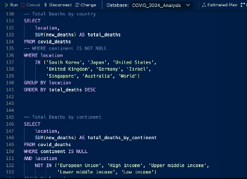

[Tableau](https://public.tableau.com/app/profile/injae.cho/viz/COVID-19inSouthKoreaARetrospectiveDataAnalysisfrom2020to2024/covid19_sk_2020_2024) was used for data visualization in this project.

# COVID-19 in South Korea: A Retrospective Data Analysis (2020-2024)

Since the outbreak of COVID-19 in 2020, the pandemic has significantly impacted our daily lives. As of May 2024, a substantial amount of data has been collected, providing insights of statistical significance. This collection facilitates a thorough retrospective data analysis.

The analysis focuses on South Korea and compares it with benchmarking countries. The country's efficient data tracking infrastructure during the pandemic can ensure data integrity, which is crucial for evaluating the effectiveness of its public health policies and understanding the broader impacts of COVID-19 on the nation.

Through this retrospective analysis, valuable lessons can be drawn that may inform future policy decisions both within South Korea and globally.

  

## Project Equipment

For this project, the following project equipment was used:

1. Source data from [Our World in Data](https://ourworldindata.org/coronavirus)
2. Azure Data Studio (for MS SQL Server)
3. Tableau Public

